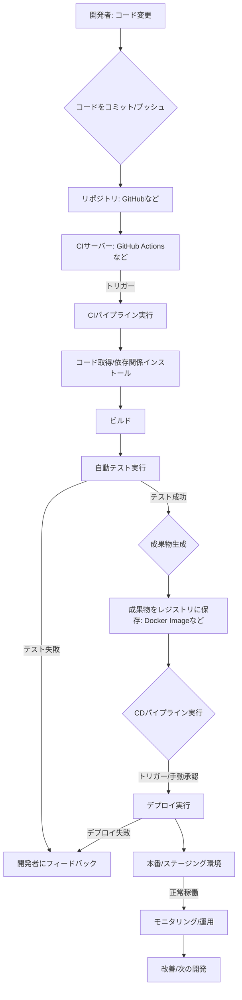

# CI/CD整備

本ドキュメントでは、Django ECSプロジェクトのCI/CD（継続的インテグレーション/継続的デプロイメント）パイプラインの構築方法について説明します。

## CI/CDとは？（初心者向け解説）

CI/CDは、開発のスピードと品質を同時に向上させるための考え方と仕組みです。

- **CI (Continuous Integration - 継続的インテグレーション)**:
開発者がコードの変更を頻繁に（日に複数回）共有リポジトリにマージし、自動的にビルドやテストを行うプロセスです。早期に問題を検出し、手戻りを減らすことが目的です。

- **CD (Continuous Delivery / Continuous Deployment - 継続的デリバリー / 継続的デプロイメント)**:
CIの後続プロセスで、いつでも本番環境にリリースできる状態を維持します。
  - **Continuous Delivery**: コード変更を本番リリース可能な状態まで自動化しますが、最終的なデプロイは手動で行います。
  - **Continuous Deployment**: テストをパスしたコード変更が、自動的に本番環境にデプロイされます。

### フローチャートで見るCI/CD

概念的なCI/CDの一般的な流れは以下のようになります。

```
+-------------------+    +----------------+    +------------------+
| 開発者: コード変更 | --> | コードをコミット/ | --> | リポジトリ(GitHub) |
+-------------------+    | プッシュ      |    +------------------+
                         +----------------+           |
                                                      | プッシュをトリガー
                                                      v
                                            +-------------------+
                                            | CIサーバー       |
                                            | (GitHub Actions)  |
                                            +-------------------+
                                                      | ワークフロー実行
                                                      v
                                            +-------------------+
                                            | CIパイプライン     |
                                            | (自動ビルド/テスト)|
                                            +-------------------+
                                                      |
                          +------------------+        | (テスト成功)
                          | テスト失敗 (フィードバック)|<-------+
                          +------------------+        |
                                                      v
                                            +-------------------+
                                            | 成果物生成/保存   |
                                            | (Dockerイメージなど)|
                                            +-------------------+
                                                      |
                                                      | (トリガー/手動承認)
                                                      v
                                            +-------------------+
                                            | CDパイプライン     |
                                            | (自動デプロイ)    |
                                            +-------------------+
                                                      |
                                                      v
                                            +-------------------+
                                            | 本番/ステージング環境|
                                            +-------------------+
                                                      |
                                                      v
                                            +-------------------+
                                            | モニタリング/運用 |
                                            +-------------------+
```



このドキュメントの後半で説明するGitHub Actionsのワークフローは、このCI/CDパイプラインを具体的に実現するための設定になります。

## CI/CDの目的

- 開発の効率化と品質向上
- 人為的ミスの削減
- デプロイ頻度の向上と時間短縮
- 自動テストによる品質保証

## GitHub Actionsによる実装

本プロジェクトでは、GitHub Actionsを使用してCI/CDパイプラインを構築します。

### ワークフロー概要

以下の3つの主要ワークフローを実装します：

1. **テストワークフロー**: すべてのプルリクエストに対して実行
2. **ステージングデプロイワークフロー**: `main`ブランチへのマージ時に実行
3. **本番デプロイワークフロー**: リリースタグ作成時に実行

### ディレクトリ構成

```
.github/
└── workflows/
    ├── test.yml         # テスト実行ワークフロー
    ├── staging.yml      # ステージング環境デプロイワークフロー
    └── production.yml   # 本番環境デプロイワークフロー
```

### ワークフローはいつ動くの？（トリガー設定）

GitHub Actionsのワークフローは、特定のイベント（きっかけ）が発生したときに自動的に実行されます。これを **トリガー** と呼びます。`*.yml` ファイルの中の `on:` という部分で、どのようなイベントでワークフローを実行するかを設定します。

このプロジェクトでは、以下のようなトリガーを設定します。

*   **`test.yml`（テストワークフロー）**:
    *   **トリガー**: `main` ブランチに向けたプルリクエストが作成されたり、更新されたりしたとき。
    *   **目的**: コードを `main` ブランチに合流させる**前**に、自動テストやコードチェックを実行して品質を確認します。

*   **`staging.yml`（ステージングデプロイワークフロー）**:
    *   **トリガー**: プルリクエストが承認されて `main` ブランチにマージ（プッシュ）されたとき。
    *   **目的**: `main` ブランチの最新のコードを、本番そっくりの**ステージング環境**に自動でデプロイします。ここで最終確認を行います。

*   **`production.yml`（本番デプロイワークフロー）**:
    *   **トリガー**: GitHub上で `v1.0.0` のような**リリースタグ**が作成されたとき。
    *   **目的**: ステージング環境で確認済みの特定のバージョンを、**本番環境**に安全にデプロイします。

このようにトリガーを設定することで、開発からテスト、リリースまでのプロセスを自動化しつつ、適切なタイミングで品質チェックや確認作業を挟むことができます。

### CI/CD作業フロー図 (Mermaid)

ローカルでの開発から本番環境へのデプロイまでの流れを図示します。

```mermaid
graph LR
    subgraph ローカル開発
        Dev[開発者: コード変更] --> Commit[git commit];
        Commit --> PushFeature["Push feature branch"];
    end

    subgraph GitHub上での作業
        PushFeature --> PR[プルリクエスト作成 (mainへ)];
        PR -- on:pull_request --> TestWF(test.yml 実行);
        TestWF -- テスト/Lint --> Review{コードレビュー};
        Review -- 承認 --> Merge[mainブランチへマージ];
        Merge -- on:push --> StagingWF(staging.yml 実行);
        StagingWF -- Dockerビルド/ECRプッシュ --> DeployStaging[ステージング環境へデプロイ];
        DeployStaging --> StagingEnv[ステージング環境];
        StagingEnv --> Confirm[動作確認];
        Confirm -- OK --> ReleaseTag[リリースタグ作成 (vX.Y.Z)];
        ReleaseTag -- on:release --> ProdWF(production.yml 実行);
        ProdWF -- Dockerビルド/ECRプッシュ --> DeployProd[本番環境へデプロイ];
        DeployProd --> ProdEnv[本番環境];
    end

    subgraph テスト/ステージング環境
        StagingEnv;
    end

    subgraph 本番環境
        ProdEnv;
    end

    TestWF -- NG --> Feedback1[開発者にフィードバック];
    Review -- NG --> Feedback2[開発者にフィードバック];
    Confirm -- NG --> Feedback3[開発者にフィードバック];
```

### テストワークフロー実装手順

1. `.github/workflows/test.yml`ファイルを作成：

```yaml
name: Run Tests

on:
  pull_request:
    branches: [ main ]

jobs:
  test:
    runs-on: ubuntu-latest
    
    steps:
    - uses: actions/checkout@v3
    
    - name: Set up Python
      uses: actions/setup-python@v4
      with:
        python-version: '3.11'
        
    - name: Install dependencies
      run: |
        python -m pip install --upgrade pip
        pip install -r app/requirements.txt
        
    - name: Run tests
      run: |
        cd app
        python manage.py test
        
    - name: Lint with flake8
      run: |
        pip install flake8
        flake8 app --count --select=E9,F63,F7,F82 --show-source --statistics
```

### ステージングデプロイワークフロー実装手順

1. `.github/workflows/staging.yml`ファイルを作成：

```yaml
name: Deploy to Staging

on:
  push:
    branches: [ main ]

jobs:
  deploy:
    runs-on: ubuntu-latest
    
    steps:
    - uses: actions/checkout@v3
    
    - name: Configure AWS credentials
      uses: aws-actions/configure-aws-credentials@v1
      with:
        aws-access-key-id: ${{ secrets.AWS_ACCESS_KEY_ID }}
        aws-secret-access-key: ${{ secrets.AWS_SECRET_ACCESS_KEY }}
        aws-region: ${{ secrets.AWS_REGION }}
        
    - name: Login to Amazon ECR
      id: login-ecr
      uses: aws-actions/amazon-ecr-login@v1
      
    - name: Build and push Docker image
      env:
        ECR_REGISTRY: ${{ steps.login-ecr.outputs.registry }}
        ECR_REPOSITORY: django-ecs-app
        IMAGE_TAG: ${{ github.sha }}
      run: |
        docker build -t $ECR_REGISTRY/$ECR_REPOSITORY:$IMAGE_TAG -t $ECR_REGISTRY/$ECR_REPOSITORY:latest .
        docker push $ECR_REGISTRY/$ECR_REPOSITORY:$IMAGE_TAG
        docker push $ECR_REGISTRY/$ECR_REPOSITORY:latest
        
    - name: Deploy to ECS
      run: |
        aws cloudformation deploy \
          --stack-name django-ecs-service-staging \
          --template-file cloudformation/ecs-service.yml \
          --parameter-overrides \
            ImageUrl=${{ steps.login-ecr.outputs.registry }}/django-ecs-app:${{ github.sha }} \
            Environment=staging
```

### 本番デプロイワークフロー実装手順

1. `.github/workflows/production.yml`ファイルを作成：

```yaml
name: Deploy to Production

on:
  release:
    types: [created]

jobs:
  deploy:
    runs-on: ubuntu-latest
    
    steps:
    - uses: actions/checkout@v3
    
    - name: Configure AWS credentials
      uses: aws-actions/configure-aws-credentials@v1
      with:
        aws-access-key-id: ${{ secrets.AWS_ACCESS_KEY_ID }}
        aws-secret-access-key: ${{ secrets.AWS_SECRET_ACCESS_KEY }}
        aws-region: ${{ secrets.AWS_REGION }}
        
    - name: Login to Amazon ECR
      id: login-ecr
      uses: aws-actions/amazon-ecr-login@v1
      
    - name: Build and push Docker image
      env:
        ECR_REGISTRY: ${{ steps.login-ecr.outputs.registry }}
        ECR_REPOSITORY: django-ecs-app
        IMAGE_TAG: ${{ github.event.release.tag_name }}
      run: |
        docker build -t $ECR_REGISTRY/$ECR_REPOSITORY:$IMAGE_TAG .
        docker push $ECR_REGISTRY/$ECR_REPOSITORY:$IMAGE_TAG
        
    - name: Deploy to ECS
      run: |
        aws cloudformation deploy \
          --stack-name django-ecs-service-prod \
          --template-file cloudformation/ecs-service.yml \
          --parameter-overrides \
            ImageUrl=${{ steps.login-ecr.outputs.registry }}/django-ecs-app:${{ github.event.release.tag_name }} \
            Environment=production
```

## GitHub Secretsの設定

GitHub上で以下のシークレットを設定します：

1. リポジトリの「Settings」→「Secrets and variables」→「Actions」に移動
2. 以下のシークレットを追加：
   - `AWS_ACCESS_KEY_ID`: AWSアクセスキーID
   - `AWS_SECRET_ACCESS_KEY`: AWSシークレットアクセスキー
   - `AWS_REGION`: AWSリージョン（例：ap-northeast-1）
   - `AWS_ACCOUNT_ID`: AWSアカウントID

## テスト自動化

### ユニットテストの実装

1. Djangoアプリケーションのテストを実装：

```python
# app/hello_django/tests.py
from django.test import TestCase, Client
from django.urls import reverse

class HealthCheckTest(TestCase):
    def test_health_check(self):
        client = Client()
        response = client.get(reverse('health'))
        self.assertEqual(response.status_code, 200)
        self.assertEqual(response.content, b'OK')
```

### カバレッジ測定

テストカバレッジを測定して報告するため、以下の手順を実装：

1. `coverage`パッケージをインストール：

```bash
pip install coverage
```

2. カバレッジレポート生成用のワークフローステップを追加：

```yaml
- name: Generate coverage report
  run: |
    pip install coverage
    cd app
    coverage run manage.py test
    coverage xml
    
- name: Upload coverage to Codecov
  uses: codecov/codecov-action@v3
  with:
    file: ./app/coverage.xml
```

## デプロイ自動化の詳細設定

### 複数環境の切り替え

環境ごとに異なる設定を適用するため、以下の方法を実装：

1. CloudFormationテンプレートにパラメーターを追加：

```yaml
Parameters:
  Environment:
    Type: String
    Default: staging
    AllowedValues:
      - staging
      - production
```

2. 環境変数を条件付きで設定：

```yaml
  WebService:
    Type: AWS::ECS::Service
    Properties:
      TaskDefinition:
        Fn::GetAtt: [TaskDefinition, Arn]
      ContainerDefinitions:
        - Name: django-app
          Environment:
            - Name: DJANGO_SETTINGS_MODULE
              Value: !If [IsProduction, "hello_django.settings.production", "hello_django.settings.staging"]
```

### デプロイ通知の設定

Slack通知を設定して、デプロイ結果を自動通知：

```yaml
- name: Slack notification
  uses: rtCamp/action-slack-notify@v2
  env:
    SLACK_WEBHOOK: ${{ secrets.SLACK_WEBHOOK }}
    SLACK_CHANNEL: deployments
    SLACK_COLOR: ${{ job.status }}
    SLACK_TITLE: Deploy to ${{ matrix.environment }}
    SLACK_MESSAGE: 'Deployment to ${{ matrix.environment }} ${{ job.status }}'
```

## CI/CD改善のロードマップ

### 短期的な改善項目

- [ ] E2Eテストの追加（Selenium/Cypress）
- [ ] セキュリティスキャンの統合（Snyk/Trivy）
- [ ] コードの静的解析（SonarQube）

### 中長期的な改善項目

- [ ] ブルー/グリーンデプロイの実装
- [ ] カナリアリリースの導入
- [ ] インフラのコード化（Terraform）の完全導入 