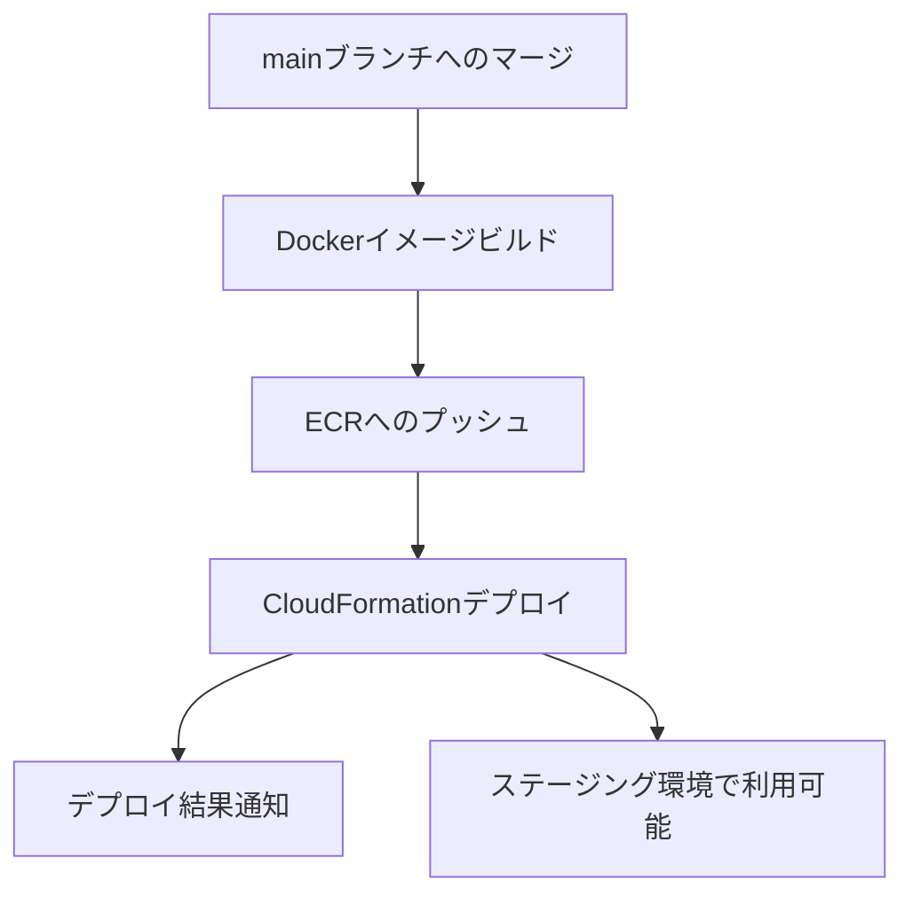
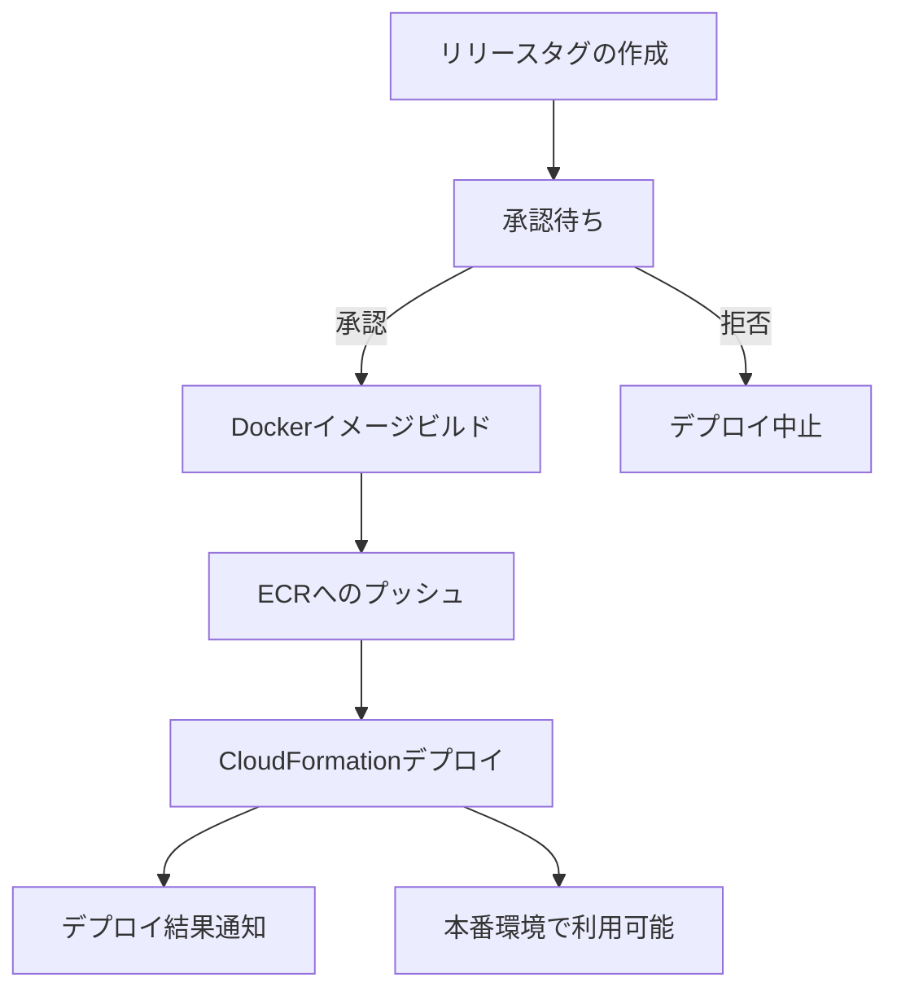

# CI/CDパイプライン ドキュメント

## 概要

このプロジェクトでは、GitHub Actionsを使用した継続的インテグレーション/継続的デリバリー（CI/CD）パイプラインを実装しています。このパイプラインは、コード品質の確保と自動デプロイを目的としています。

## ワークフロー一覧

本プロジェクトでは、以下の3つの主要なワークフローを使用しています：

1. **テスト (Test)**
   - 全てのプルリクエストとmainブランチへのプッシュ時に実行
   - コードの品質チェックとテストを実行

2. **ステージング (Staging)**
   - mainブランチへのマージ後に自動的に実行
   - ステージング環境へのデプロイを行う

3. **本番 (Production)**
   - リリースタグ作成時に実行
   - 本番環境へのデプロイを行う（承認プロセスあり）

## 環境構成

プロジェクトでは以下の環境を使用しています：

| 環境       | 目的                           | デプロイトリガー        | 承認プロセス |
|------------|--------------------------------|------------------------|--------------|
| 開発       | ローカルでの開発作業           | 手動                   | なし         |
| ステージング | テスト・検証環境              | mainブランチへのマージ  | なし         |
| 本番       | エンドユーザー向け実稼働環境   | リリースタグの作成     | あり         |

## CI（継続的インテグレーション）プロセス

テストワークフローでは以下のステップを実行します：

1. **コードの静的解析**
   - `ruff`によるコードフォーマットチェック
   - `bandit`によるセキュリティチェック

2. **自動テスト**
   - `pytest`を使用したユニットテスト
   - テストカバレッジの計測

## CD（継続的デリバリー）プロセス

### ステージング環境へのデプロイフロー

1. mainブランチへのマージがトリガー
2. Dockerイメージのビルドと ECR へのプッシュ
3. AWS CloudFormation を使用したECSクラスターとサービスのデプロイ
4. デプロイ結果の通知（成功/失敗）

### 本番環境へのデプロイフロー

1. GitHub上でリリースタグを作成
2. 承認者による承認プロセス（必須）
3. 承認後、Dockerイメージのビルドと ECR へのプッシュ
4. AWS CloudFormation を使用したECSクラスターとサービスのデプロイ
5. デプロイ結果の通知（成功/失敗）

## リリースプロセス

### リリースタグの作成手順

1. GitHub リポジトリページで「Releases」セクションに移動
2. 「Draft a new release」ボタンをクリック
3. バージョン番号を「v1.0.0」形式で入力
   - メジャーバージョン: 大きな変更・互換性のない変更
   - マイナーバージョン: 機能追加・互換性のある変更
   - パッチバージョン: バグ修正・小さな変更
4. リリースタイトルと説明文を入力
5. リリースノートには以下の内容を含める：
   - 新機能の説明
   - バグ修正の内容
   - 非推奨機能の告知
   - 既知の問題点
6. 「Publish release」ボタンをクリック

### デプロイ前チェックリスト

- [ ] すべての自動テストがパスしている
- [ ] セキュリティスキャンに問題がない
- [ ] リリースノートが完成している
- [ ] データベースマイグレーションの確認
- [ ] 環境変数の設定確認
- [ ] バックアップの確認
- [ ] ロールバック手順の確認

## トラブルシューティング

### よくある問題と解決策

1. **デプロイ失敗**
   - CloudFormation スタックのイベントログを確認
   - ECR にイメージが正しくプッシュされたか確認
   - IAM 権限の確認

2. **テスト失敗**
   - エラーメッセージの確認
   - ローカルでのテスト実行による再現確認
   - 依存関係の問題がないか確認

3. **環境変数問題**
   - GitHub Secrets の設定確認
   - 環境ごとの変数が正しく設定されているか確認

## 参考リンク

- [GitHub Actions ドキュメント](https://docs.github.com/ja/actions)
- [AWS CloudFormation ドキュメント](https://docs.aws.amazon.com/ja_jp/cloudformation/)
- [AWS ECS ドキュメント](https://docs.aws.amazon.com/ja_jp/ecs/) 